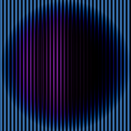

ff-tools
========

**A collection of farbfeld tools**

This is a collection of tools working with the
[farbfeld](https://tools.suckless.org/farbfeld/) image file format.

Sample image:

    # ( cos * sin ) * color
    cat <( \
        cat <(ff-cosgen 512 512 3) \
            <(ff-singen 512 512 5) | ff-mul) \
        <( ff-color 512 512 0.8 0.9 0.2) | ff-mul

Generators
----------

- `ff-color` A static color generator
- `ff-cosgen` A cos-wave generator (x-direction)
- `ff-singen` A sinewave generator (x-direction)

Functions
---------

- `ff-chuffle` A channel shuffler
- `ff-mul` A multiplication tool

Corrections
-----------

- `ff-gamma` A gamma tool

Manual
======

General Usage
-------------

All of these tools have their input via `stdin` and output to `stdout`. So you
should use the like this:

    cat image.ff | ff-tool [parameters] | viewer

For example to view a `.png` file with lel and basic gamma applied:

    cat file.png | png2ff | ff-gamma | lel

(assuming you have [farbfeld](https://tools.suckless.org/farbfeld/) and
[lel](http://git.2f30.org/lel/) installed)

Generators
----------

Generators do not have input images, they just produce images from scratch
(and a few parameters).

- `ff-color width height red green blue [alpha]`. Output: Image (width x
  height)
- `ff-cosgen width height steps`. Output: Image (width x height)
- `ff-singen width height steps`. Output: Image (width x height)

Functions
---------

- `ff-chuffle r g b a`.  
  Input: Image  
  Output: Image with shuffled rgba channels  
  Examples:
  - `cat image.ff | ff-chuffle g b r a > result.ff` (rotates rgb)
  - `cat image.ff | ff-chuffle g g r a > result.ff` (fill more channels,
    discard others)
- `ff-mul`.  
  Input: Two images with the exact same size.  
  Output: Multiplication result.  
  Example: `cat a.ff b.ff | ff-mul > result.ff`

Corrections
-----------

- `ff-gamma [gamma]`.  
  Input: Image  
  Output: Image with gamma (default: 2.2)  
  Examples:
  - `cat image.ff | ff-gamma > result.ff`  
  - `cat image.ff | ff-gamma 3.4 > result.ff`
